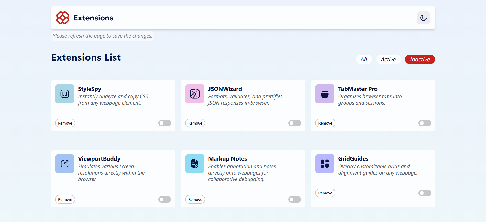
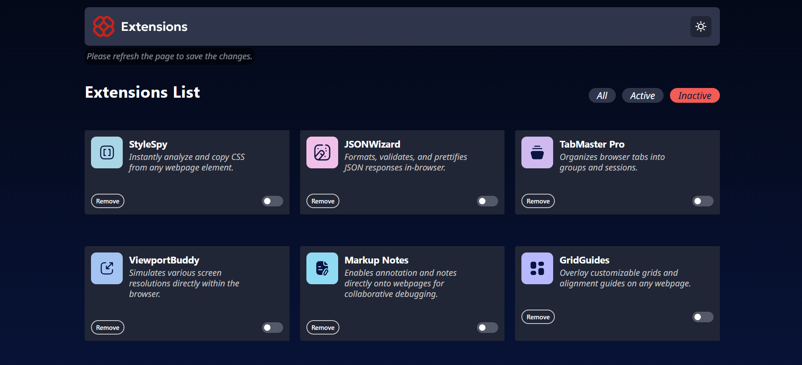

# Frontend Mentor - Browser extensions manager UI solution

This is a solution to the [Browser extensions manager UI challenge on Frontend Mentor](https://www.frontendmentor.io/challenges/browser-extension-manager-ui-yNZnOfsMAp). Frontend Mentor challenges help you improve your coding skills by building realistic projects. 

## Table of contents

- [Overview](#overview)
  - [The challenge](#the-challenge)
  - [Screenshot](#screenshot)
  - [Links](#links)
- [My process](#my-process)
  - [Built with](#built-with)
  - [What I learned](#what-i-learned)
  - [Continued development](#continued-development)
  - [Useful resources](#useful-resources)
- [Author](#author)

## Overview

### The challenge

Users should be able to:

- Toggle extensions between active and inactive states
- Filter active and inactive extensions
- Remove extensions from the list
- Select their color theme
- View the optimal layout for the interface depending on their device's screen size
- See hover and focus states for all interactive elements on the page

### Screenshot
- Light Mode:
  

- Dark Mode:
  

### Links

- Solution URL: [Github](https://github.com/Diego2Drm/browser-extensions-manager-ui)
- Live Site URL: [Browser extensions manager UI](https://diego2d-browser-extensions-manager-ui.netlify.app/)

## My process

### Built with

- Semantic HTML5 markup
- CSS custom properties
- Flexbox
- CSS Grid
- Mobile-first workflow
- [React](https://reactjs.org/) - JS library
- [Tailwind CSS v4.1](https://tailwindcss.com/docs/installation/using-vite) - For styles
- [Redux Toolkit](https://redux-toolkit.js.org/tutorials/quick-start)


### What I learned

-I learned to use Redux Toolkit in this project.

```js ->app/store
  import { configureStore } from "@reduxjs/toolkit";
  import cardReducer from "../features/card/cardSlide"

  const stateLocalStorageMiddleware = store => next => action => {
    next(action);
    localStorage.setItem("__redux__state__", JSON.stringify(store.getState()));
  }

  export const store = configureStore({
    reducer: {
      data: cardReducer,
    },
    middleware: (getDefaultMiddleware) => {
      return getDefaultMiddleware().concat(stateLocalStorageMiddleware);
    }
  });
```
```js ->features/Slide
  import { createSlice } from "@reduxjs/toolkit";
import JsonData from "../../data.json"

const DEFAULT_STATE = JsonData
// const DEFAULT_STATE = JsonData.map(item => ({ ...item, isDeleted: false }));

const initialState = (() => {
  const stateLocalStorage = localStorage.getItem("__redux__state__");
  if (stateLocalStorage) return JSON.parse(stateLocalStorage).data;
  return DEFAULT_STATE;

})();

export const cardSlice = createSlice({
  name: "data",
  initialState,
  reducers: {
    removeExtension: (state, action) => {
      // const IdName = action.payload;
      // return state.filter(extension => extension.name !== IdName)
      const itemIndex = state.findIndex(extension => extension.name === action.payload);
      if (itemIndex !== -1) {
        state[itemIndex].isDeleted = true
      }
    },
    restoreExtension: (state, action) => {
      const itemIndex = state.findIndex(extension => extension.name === action.payload);
      if (itemIndex !== -1) {
        state[itemIndex].isDeleted = false;
      }
    },
    isActiveExtencion: (state, action) => {
      const actives = [...state];
      const activeIndex = actives.findIndex(
        active => active.name == action.payload
      );
      if (activeIndex !== -1) {
        actives[activeIndex].isActive = !actives[activeIndex].isActive
      }
    },
    setAllExtensions: () => {
      return initialState
    },
  }
});

export const { removeExtension, isActiveExtencion, setAllExtensions, restoreExtension } = cardSlice.actions;
export default cardSlice.reducer;

```

### Continued development

I will continue learning Redux Toolkit through its documentation and available tutorials.

### Useful resources

-[Redux Toolkit](https://redux-toolkit.js.org/tutorials/quick-start) - This helped me learn Redux Toolkit.

## Author

- Website - [Diego Ramírez](https://diego2drm.github.io/Portafolio/)
- Frontend Mentor - [@Diego2Drm](https://www.frontendmentor.io/profile/Diego2Drm)
- Gmail - [diego.ramirez2d03@gmail.com]
- Website - [https://diego2drm.github.io/Portafolio/]